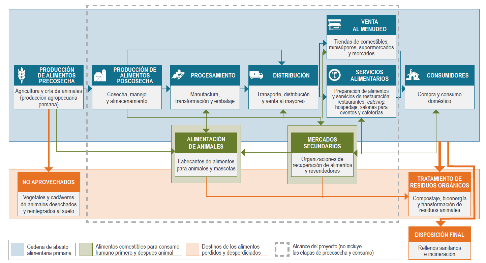

---
title: ''
output: pdf_document
--- 


<div style="text-align: center">

```{r fig.align='center', out.width= '100%', echo=FALSE, cache=TRUE}


```

</p>
<br>
<div style="text-align: justify">
<div class=text-justify>

</div>
</br>
</br>
<div class=text-justify>

# **1. Introducción**

</br>

El Instituto Nacional de Estadística y Geografía presenta la **Encuesta sobre Residuos Alimenticios y Materia Orgánica (ERAMO)** cuyo propósito es contribuir a la caracterización y medición de la **Pérdida y Desperdicio de Alimentos (PDA)**, mismo que se ha convertido en un problema internacional debido a la cantidad de alimentos que se pierden en la cadena de abasto alimentaria, provocando con ello, un enorme impacto social, económico y ambiental. De acuerdo con estudios de la **Organización de las Naciones Unidas para la Agricultura y la Alimentación (FAO)** así como del **Instituto de Recursos Mundiales (WRI**) se estima que a nivel mundial un **tercio de la producción** de alimentos se pierden o se desperdician desde la producción hasta al lugar de consumo.

En relación a los recursos naturales, los alimentos que se pierden y desperdician consumen una cuarta parte del agua utilizada anualmente por la agricultura, requieren un área de cultivo similar a la extensión territorial de China y generan un estimado del 8 % de las emisiones globales de gases de efecto invernadero (GEI). De hecho, si los alimentos que se pierden y desperdician fueran un país, sería el tercer emisor de GEI más grande del planeta, solo detrás de China y Estados Unidos (WRI, 2016).

La **Organización de las Naciones Unidas (ONU)** ha volteado su mirada hacia este problema y ha propuesto incluir, entre los **Objetivos de Desarrollo Sostenible (ODS)**, la meta [**12.3**](https://www.un.org/sustainabledevelopment/es/sustainable-consumption-production/) la cual establece "*De aquí a 2030, reducir a la mitad el desperdicio de alimentos per capita mundial en la venta al por menor y a nivel de los consumidores y reducir las pérdidas de alimentos en las cadenas de producción y suministro, incluidas las pérdidas posteriores a la cosecha*".

Como parte del compromiso del país con el cumplimiento de los ODS, el INEGI, desde 2019, realiza trabajos con el objetivo de contribuir al cálculo del impacto ambiental y socioeconómico que resulta de la pérdida y desperdicio de alimentos y materiales orgánicos mediante la generación de información estadística y geográfica veraz y oportuna con la finalidad de apoyar a los tomadores de decisiones en la elaboración de políticas públicas sobre recursos naturales, energía y el medio ambiente en general. 

La ERAMO impulsa un nuevo tema de estudio para el instituto, pretende ir a todas las etapas de la cadena de abasto alimentaria para recabar información que contribuya a la medición del fenómeno, traduciendose a políticas nacionales encaminada al fomento de su reducción, recuperación de alimentos y reciclaje de desechos alimentarios.

Este proyecto, impulsado por la **Dirección de Estadísticas del Medio Ambiente**, perteneciente a la **Dirección General de Geografía y Medio Ambiente** de INEGI, pretende captar información sobre el volumen de residuos de alimentos que se pierden y desperdician desde el momento posterior a la cosecha y crianza de los animales hasta la etapa de venta al menudeo y la de servicios alimentarios (preparación de alimentos y servicios de restaurantes, hospedaje, salones para eventos, cafeterías, etc.).

La encuesta está dirigida a identificar la **pérdida** de alimentos, entendida como aquellos alimentos destinados al consumo humano que, debido al mal funcionamiento de los sistemas de producción y distribución de estos, disminuyen en cantidad o calidad. Se cree que la causa principal de la pérdida de alimentos sucede dentro de la cadena de abasto alimentaria; por ejemplo, alimentos que se pudren en el campo o en bodegas debido a un mal manejo, tecnología o refrigeración inadecuada, o alimentos que no llegan al mercado debido a una infraestructura deficiente y que por lo tanto no se consumen.

También, pretende caracterizar el **desperdicio** de alimentos, entendido como aquellos alimentos destinados al consumo humano que se desechan (partes tanto comestibles como no comestibles) de manera intencional. Usualmente se asocia al desperdicio de alimentos con lo que sucede a lo largo de la cadena alimentaria desde la tienda de venta al menudeo hasta el punto de consumo propuesto. El desperdicio de alimentos, en algunas ocaciones, se debe a decisiones que tienen que ver con cálculos erroneos en la preparación de alimentos o a descuidos en el manejo de los alimentos.

La diferencia principal entre la **pérdida y el despericio** de alimentos estriba en que la pérdida tiende a centrarse en las etapas iniciales de la cadena de abasto alimentaria es decir, en las etapas de producción y procesamiento de alimentos, mientras que el desperdicio de alimentos se concentra sobre todo en las etapas finales de la cadena  distribución, venta al menudeo, servicios de preparación de alimentos y consumo). El INEGI, junto con otras instituciones, organizaciones y la academia pretenden definir los mecanismos para captar la información necesaria que de soporte a las iniciativas en curso y las venideras para abordar y ofrecer soluciones a este problema nacional y mundial.

<br>

#### **Factores ambientales que resultan de la pérdida y el desperdicio de alimentos**

<br>

**Agua**

<br>

Entre los efectos ambientales que resultan de la pérdida y desperdicio de alimentos se encuentra el tema del recurso hidríco, el cual es necesario analiza, al menos en dos niveles: el consumo del recurso destinado para la producción de alimentos y como residuos que terminan contaminando los ríos y cuerpos de agua. Aprovechar de manera eficiente los alimentos y sus residuos evita que se contaminen las aguas superficiales y subterráneas.

En algunos países se ha comprendido la importancia de un manejo apropiado de los residuos orgánicos y alimentarios, tal es el caso en estados de Norteamérica, donde se les obliga a definir metas de aprovechamiento para evitar que lleguen a los sitios de disposición final. Entre los aprovechamientos se pueden mencionar a la Universidad Purdue (Indiana), donde los desechos alimentarios se recolectan del campus y se envían a plantas de tratamiento de aguas residuales para codigestión, lo que contribuye a la generación de electricidad para la planta de tratamiento misma.

<br/>

<p align="center"> **Consumo de agua en la producción de alimentos que se pierden o desperdician, para los países de América del Norte** </p>

<br/>


```{r agua1, echo=FALSE, out.width= "60%",warning=FALSE}
library(kableExtra)
agua1 <- read.csv("tab/agua.csv", encoding = "UTF")
names(agua1) <- c( "PAÍS / REGIÓN", "CONSUMO DE AGUA (MILES DE MILLONES DE METROS CÚBICOS)")

kableExtra::kable(agua1, align = c('l','r')) %>%
 kableExtra::kable_styling(bootstrap_options = c("striped", "hover"))

```  
**Fuente**: [Kummu et al.(2012), _Lost food, wasted resources: Global food supply chain losses and their impacts onfreshwater, cropland, and fertiliser use_, Science of the Total Environment 438 (2012) 477–489](pdfs/kummu_2012.pdf){target="_blank"} 
</br>
</br>

La pérdida y desperdicio de alimentos conllevan un derroche de recursos naturales para que sea posible su producción, no se trata solamente del suelo o fertilizantes, sino también del agua que se necesitó para su desarrollo. Como se aprecia en el cuadro anterior, más de 17 millones de metros cúbicos al año fueron utilizados en la producción de alimentos que terminaron en la basura o en aguas residuales.

</br>

**Suelos**

Los impactos que genera la cantidad de residuos orgánicos que llegan a los sitios de disposición final municipales y privados en México tiene impacto no sólo con las emisiones de metano, pues los residuos que llega estos sitios puede estar compuesta de hasta el 50 % de residuos orgánicos, lo que se traduce en superficie y espacio destinado para recibir los residuos municipales se debe (al menos por lo que toca a la mitad del problema) a los residuos de tipo orgánico.

De acuerdo con el informe **Huella del despilfarro de alimentos** de FAO (2013), entre los impactos al ambiente que resultan de la cadena alimentaria, desde su producción hasta la pérdida y desperdicio de alimentos, podemos encontrar: millones de hectáreas de tierras de cultivo desperdiciadas; millones de toneladas de fertilizantes aplicados; millones de m<sup>3</sup> de espacio ocupado en rellenos sanitarios; millones de dólares estadounidenses (USD) pagados en tarifas por descarga o depósito de desechos; millones de USD en concepto de pérdida de biodiversidad y billones de kilocalorías (kcal = 1,000 calorías) en posible pérdida de energía.

El momento de la producción de alimentos se caracteriza por ser el de mayor exposición a la pérdida de alimentos, pues los factores que inciden para que ello suceda son numerosos y van desde la semilla, los abonos, las plagas y enfermedades de los cultivos, la tecnología, forma de producción, monocultivo, tipo de intercalado, el clima, estándares de calidad y los precios de mercado, sólo por mencionar algunos. Las pérdidas pueden ser parciales o totales y generalmente se cuantifica por toneladas y pueden ser de desde decenas hasta miles de ellas. 

El suelo juega un papel importante en la cantidad y calidad de los alimentos producidos, pues la erosión y salinización reducen la capacidad de los suelos para el intercambio de nutrientes con los cultivos. [Estimaciones de la FAO del año 2015](http://www.fao.org/news/story/es/item/357165/icode/){target="_blank"}, indican que se pierden aproximadamente 7.6 millones de toneladas de producción de cereales por estas causas. El reto para el año 2050, no sólo es producir más alimentos para la creciente población mundial sino además, evitar que cerca de 1.5 millones de kilómetros cuadrados de tierras agrícolas se pierdan por causa de la erosión.

</br>

**Gases de Efecto Invernadero**

Un tema fuertemente vinculado a la pérdida y el desperdicio de alimentos es la generación de metano, uno de los gases con mayor capacidad de efecto invernadero, la fuente de este gas resulta de la descomposición de los residuos orgánicos ubicados en los sitios de disposición final. La **Comisión de Cooperación Ambiental para América del Norte (CCA)**, estima que los tres países que conforman el TLCAN, generan aproximadamente el equivalente a 200 millones de toneladas de CO<sub>2eq</sub> al año.

Los países de América del Norte han generado información sobre la cantidad de emisiones de GEI que resultan de los rellenos sanitarios ubicados en sus territorios, con el objeto de cumplir con el compromiso de la **Convención Marco de las Naciones Unidas sobre el Cambio Climático (CMNUCC)**, el cual trata de estimaciones relativas a las emisiones de este tipo de gases usando metodologías aprobadas por el **Panel Intergubernamental sobre el Cambio Climático (IPCC)**.

<br/>

<p align="center"> **Emisiones anuales estimadas de GEI procedentes de la disposición final de residuos orgánicos** </p>

<br/>

############ ADECUAR VALORES DE LA TABLA, LAS CIFRAS COINCIDEN CON LA TABLA ANTERIOR

```{r gei1, echo=FALSE, out.width= "60%",warning=FALSE}
library(kableExtra)
gei1 <- read.csv("tab/emisiones.csv", encoding = "UTF")
names(gei1) <- c( "PAÍS", "EMISIONES")

kableExtra::kable(gei1, align = c('l','r')) %>%
 kableExtra::kable_styling(bootstrap_options = c("striped", "hover"))

```  
**Nota**:  *Es probable que las emisiones provenientes de la gestión de residuos orgánicos en México, sean considerablemente más elevadas que las mostradas en este cuadro. No obstante, resulta complicado obtener estimaciones confiables de tales emisiones debido a la falta de información coherente y confiable, así como al elevado número de rellenos sanitarios y vertederos a cielo abierto que operan sin ningún tipo de control en México.*

**Fuente**: [CCA (2017), _Caracterización y gestión de los residuos orgánicos en América del Norte, informe sintético_, Comisión para la Cooperación Ambiental, Montreal, 52 pp](pdfs/11770-characterization-and-management-organic-waste-in-north-america-white-paper-es.pdf){target="_blank"} 

La cuantificación de la materia orgánica que se genera es útil para la medición del impacto ambiental que genera su descomposición y conversión a GEI. Para reducir y eventualmente evitar el destino de los residuos orgánicos a los sitios de disposición final es conveniente caracterizar tipo, origen y causa del desecho o desperdicio, que por otra parte permitan elaborar políticas públicas o programas de reducción. Es en este contexto es que la ERAMO puede jugar un papel importante para disponer de información sobre el tipo de residuos y las causas que dan pie a la pérdida y el desperdicio de alimentos. 

</br>
</br>

# **2. Documentación de necesidades**

</br>

Actualmente existen estudios que hacen medición y/o estimación del desperdicio y pérdida de los alimentos, sin embargo se requiere de un respaldo estadístico con mayor envergadura que recupere las distintas realidades de nuestro vasto territorio y diversidad cultural. Lograr la cuantificación de la materia orgánica es un área de oportunidad para intentar reducir su presencia en los sitios de disposición final mediante procesos eficientes que permitan el aprovecharmiento y procesamiento de esos residuos, así como “concientizar respecto de prácticas óptimas y opciones de políticas con el fin de fomentar el desvío y procesamiento de residuos orgánicos” (CCA, 2014).

Es de suma importancia contar con datos de Pérdida y Desperdicio de Alimentos con mayor precisión en términos de la disposición final de estos, ya que al descomponerse generan emisiones de GEI, los cuales afectan la calidad del aire. La CCA tiene estimaciones de las emisiones anuales de estos gases en los países de Estados Unidos, Canadá y México, estas representan: 148, 26 y 21.5 millones de toneladas métricas equivalentes a CO<sub>2</sub> respectivamente. Así también, se calcula que el tiempo de residencia del metano en la atmósfera, es de cerca de doce años, sin embargo se requieren datos más eficientes del volumen generado, en particular para nuestro país.

México carece de información oportuna y recurrente respecto de la pérdida y desperdicio de alimentos, la cual serviría de base para desarrollar estrategias y priorizar acciones en la prevención del tema en cuestión, a su vez ésta fuera de útilidad para identificar el uso más adecuado para la PDA entre los entes que proporcionen la información en un ejercicio de retroalimentación para los informantes. Diversos métodos de cuantificación se hacen necesarios, en el caso de INEGI, se pone a disposición el conocimiento y experiencia sobre el uso de las encuestas como método de contribución a la medición del problema.

Diversas instituciones nacionales e internacionales del medio ambiente, académicos e investigadores en Turismo, Agricultura, Ganadería, Desarrollo Rural, Pesca y Alimentación, así como la Comisión Nacional de Acuacultura y Pesca, el Servicio Nacional de Sanidad, Inocuidad y Calidad Agroalimentaria, la Agencia de Servicios a la Comercialización y Desarrollo de Mercados Agropecuarios, Diconsa y el Servicio de Información Agroalimentaria y Pesquera, el Banco Mundial, FAO, CCA, WRI, entre muchas otras, han realizado estudios e investigaciones de gran utilidad, dicha labor requiere concretarse en un sistema o sitio que dé soporte a la consulta y actualización de la información, así como a las estrategias y políticas públicas que se adopten.

</br>
</br>

# **3. Importancia de la estadística por generar con la ERAMO**

</br>

La relevante información que se espera obtener de la ERAMO es viable para ser considerada Información de Interés Nacional ya que atendiendo las disposiciones del Reglamento referido para tal denominación, el cual se publicó el 9 de abril de 2018 en el Diario Oficial de la Federación (DOF), en el se señalan cuatro criterios: primero, la ERAMO se encuentra incluida en el tema de residuos sólidos; segundo, la ERAMO es necesaria para sustentar el diseño y la evaluación de las políticas públicas de alcance nacional, por lo que ambos criterios aplican; tercero y cuarto, indican que la información deba ser generada en forma regular y periódica, así como ser elaborada con base en una metodología científicamente sustentada, que también son viables de cubrir.

El impacto del crecimiento mundial estimado para el año 2050 predice que la población ascenderá a más de 9 mil millones de personas, lo que implica un aumento del 70 % de la producción actual de alimentos, lo cual demandará ampliar de 1,400 millones de hectáreas a más de 1,600 en el mismo lapso de tiempo, a costa de los recursos naturales existentes para ese entonces, como son los suelos con vegetación, agua y ecosistemas en general.

Los residuos orgánicos generados en Canadá, Estados Unidos y México se depositan predominantemente en rellenos sanitarios, basureros y tiraderos a cielo abierto, lo que resulta en una alta concentración de emisiones de metano que al no ser capturados y utilizados para producir electricidad son liberados al aire con los consecuentes daños al ambiente. Al identificar la fuente que da origen a los residuos permitirá proponer medidas que apoyen a mitigar la generación de dichas emisiones.

Al reconocer y caracterizar los residuos alimenticios y orgánicos y sus posibles destinos, como el composteo, bancos de alimentos, alimentación animal, generación de biomaterial, codigestión anaerobia, entre otros, contribuirán al diseño de políticas que permitan eficientar el manejo y uso de dichos residuos.

Según la CCA, la pérdida y el desperdicio de alimentos (PDA) es un tema que cobra cada vez mayor relevancia. Canadá, Estados Unidos y México, países donde anualmente se pierden y desperdician, durante la cadena de abasto alimentaria, incluidas las etapas de precosecha y consumo, casi 170 millones de toneladas de alimentos producidos para consumo humano, provocando un enorme agotamiento de recursos para su producción, reflejados en la evidente erosión de una gran superficies de suelo provocado por los cambios en su uso, fragmentación de ecosistemas que repercute en la pérdida de flora y fauna, el mal uso de los recursos hídricos, incidiendo problemas de salud humana.

La preocupación sobre la PDA ha involucrado no solo a gobiernos y el sector privado, si no que también a organizaciones como Save Food, Piensa-Aliméntate-Ahorra, dirigido por la FAO; el PNUMA; Foro de Bienes de Consumo, "Every Crumb Counts (Cada Miga Cuenta)" de Food Drink Europe, el Compromiso Courtauld 2025 en el Reino Unido y la Alianza para la Reducción de Desperdicio de Alimento en los Estados Unidos, solo por mencionar akgunos con la conciecia y relevancia que cobra día a día este fenómeno mundial.
 
</br>
</br>

# **4. Fundamento Legal**  

</br>

La Dirección de Estadísticas del Medio Ambiente, en conjunto con la Red **12.3** (grupo de investigadores y docentes interdisciplinarios de nivel superior y postgrado), realizaron la prueba piloto denominada ERAMO (Ecuesta Nacional sobre Residuos Alimenticios y Materia Orgánica), el proyecto intenta obtener información sobre los residuos alimenticios procedentes de la industria alimentaria, de servicios de alimento públicos y privados; a fin de conocer el origen de su generación, cantidad, composición, reutilización, tratamiento y disposición final, con el propósito de generar información valiosa para conocer el fenómeno de la PDA y facilitar, en lo posible, la toma de decisiones técnicamente sustentadas. Lo anterior está fundamentado en las siguientes disposiciones legales:

</br>

[**Ley del Sistema Nacional de Información Estadística y Geográfica**](https://sc.inegi.org.mx/repositorioNormateca/Lmj2_SNIEG.pdf)

**Sección III**

**Del Subsistema Nacional de Información Geográfica y del Medio Ambiente**

**ARTÍCULO 27.-** El Subsistema Nacional de Información Geográfica, Medio Ambiente, Ordenamiento Territorial y Urbano, en su componente del medio ambiente, procurará describir el estado y las tendencias del medio ambiente, considerando los medios naturales, las especies de plantas y animales, y otros organismos que se encuentran dentro de estos medios.

El Subsistema referido en el párrafo anterior, deberá generar, como mínimo, indicadores sobre los siguientes temas: atmósfera, agua, suelo, flora, fauna, residuos peligrosos y **residuos sólidos**.

**ARTÍCULO 28.-** El Instituto elaborará, con la colaboración de las Unidades, los indicadores a que se refieren los dos artículos anteriores a partir de la información básica proveniente de: I. El Sistema Nacional de Información Ambiental y de Recursos Naturales; II. Un sistema integrado de inventarios y encuestas sobre recursos naturales y medio ambiente, y III. Los registros administrativos que permitan obtener Información en la materia.

</br>

[**Reglamento Interior del Instituto Nacional de Estadística y Geografía**](https://sc.inegi.org.mx/repositorioNormateca/R_INEGI_20.pdf)

**ARTÍCULO 26.-** Son atribuciones específicas de la Dirección General Adjunta de Recursos Naturales y Medio Ambiente, las siguientes:

**I.** Desarrollar proyectos de disposiciones normativas para someterlas a consideración del Director General de su adscripción, sobre los procesos de generación, integración, validación y explotación de información sobre recursos naturales y medio ambiente, producida por las Unidades Administrativas del Instituto y demás Unidades del Estado conforme a lo dispuesto en la Ley;

**II.** Participar en las actividades de diseño, planeación, levantamiento, tratamiento, procesamiento, evaluación y control de calidad de los módulos de encuestas en hogares, establecimientos económicos y gobiernos, así como levantamientos muestrales sobre el estado de los recursos naturales y el medio ambiente para su integración al Sistema y el programa de planeación territorial;

**VI.** Coordinar y concertar con las Unidades del Estado generadoras de información las acciones necesarias para el diseño de la infraestructura conceptual y la producción de información estadística básica e indicadores del medio ambiente para unificar la generación de información por parte de las Unidades del Estado;

**XVI.** Asesorar a las Unidades del Estado, en la explotación de los resultados de censos, encuestas y registros administrativos sobre datos del medio ambiente;

**XVII.** Desarrollar y proponer metodologías, relativas a conceptualización, levantamiento, aprovechamiento, procesamiento y explotación de encuestas y registros administrativos del medio ambiente, por parte de las Unidades del Estado y asesorarlos en su implementación para garantizar su aprovechamiento por los usuarios del Sistema en la toma de decisiones, en los ámbitos público y social;

</br>

[**Manual de Organización Específico. Dirección General de Geografía y Medio Ambiente**](https://sc.inegi.org.mx/repositorioNormateca/MO2_13Feb20.pdf)

**Dirección de Estadísticas del Medio Ambiente**

Objetivo:

Coordinar con las Unidades del SNIGMAOTU, la generación de las estadísticas básicas y derivadas en materia ambiental de interés nacional, de acuerdo a la aplicación de la normatividad estadística para el diseño, ejecución y evaluación de las políticas públicas sobre medio ambiente y desarrollo sustentable del país.

</br>
</br>

# **5. Unidades de observación para la ERAMO**

</br>

La encuesta está dirigida a los sectores productivos: agricultura, cría de animales, caza y pesca; industria de alimentos y bebidas; transporte y almacenamiento; comercio al por mayor y menudeo; servicios de preparación de alimentos y bebidas, considerando para la selección de estas el [**Sistema de Clasificación Industrial de América del Norte 2018 (SCIAN)**](https://www.inegi.org.mx/contenidos/productos/prod_serv/contenidos/espanol/bvinegi/productos/nueva_estruc/702825099695.pdf). 

Para una mejor comprensión de los momentos de la cadena de alimentos que comprende la encuesta, se muestran los conceptos que la CCA considera como objeto de estudio.

- “La producción de alimentos **poscosecha** abarca las actividades poscosecha que se llevan a cabo en la granja y también aquellas que implican cosecha, manejo y almacenamiento de plantas o de animales (ganado, aves, mariscos) o sus partes, pero que se realizan fuera del sector agrícola (adaptado de Grolleaud, 2001).  

- El procesamiento de alimentos es la **transformación** de alimentos crudos en productos aptos para consumo, cocinado o almacenamiento (EUFIC, 2016). El término 'procesamiento de alimentos' equivale a la 'transformación o fabricación de alimentos'.  

- La **distribución** abarca el transporte y la distribución de productos alimenticios antes de la recepción por el consumidor e incluye la venta al mayoreo e intermediación (adaptado de Perner, 2008).  

- La **venta** al menudeo se refiere a la oferta de alimentos para uso en el hogar, en negocios de servicio directo al consumidor (tiendas o mercados). Excluyendo la venta en restaurantes o en ámbitos institucionales (adaptado de Suttle, s.f.).  

- Los **servicios alimentarios** abarcan la preparación de alimentos y los servicios de comida, bocadillos y bebidas para consumo fuera del hogar (o para llevar), en establecimientos formales o de comida rápida y en ámbitos comerciales e institucionales, como restaurantes, salones de eventos, hoteles y cafeterías.” CCA (2017:6)

</br>
</br>

# **6. Método para generar la información estadística para la ERAMO**

</br>

La Comisión de Cooperación Ambiental para América del Norte, decidió usar diversos métodos de medición existentes para la obtención de datos sobre la PDA, entre ellos se encuentran: los diarios o bitácoras de los informantes; la medición directa; entrevistas y encuestas; balance de masas; datos sustitutos o indirectos; registros administrativos; así como el análisis de composición de desechos.  

En el caso de la prueba piloto ERAMO, el método definido para la obtención de la información sobre pérdida y desperdicio es una encuesta, a partir de una muestra representativa de todos los sectores de actividad relacionados con los alimentos, que para nuestro país incluyó alrededor de 180 clases de actividad, considerando desde la producción agropecuaria en el sector primario, la transformación de los alimentos en el sector secundario hasta la comercialización y venta de productos en el sector terciario.

Para la organización de la información, se adoptó el **Modelo Genérico del Proceso Estadístico (GSBPM por sus siglas en inglés)**, desarrollado por la **Comisión Económica de las Naciones Unidas para Europa (UNECE)**, el cual describe y define el conjunto de procesos necesarios para producir estadísticas oficiales, mismo que provee un marco estándar y una terminología armonizada para ayudar a las organizaciones estadísticas a modernizar los procesos de producción estadística, así como compartir métodos y componentes.

Con el propósito de estandarizar sus procesos, el INEGI llevó a cabo la adecuación de dicho modelo, así como su armonización con el marco normativo aplicable al mismo. Resultado de lo anterior, es la **Norma Técnica del Proceso de Producción de Información Estadística y Geográfica**, emitida por la Junta de Gobierno interna (agosto de 2018). Dicha norma se utilizó para la organización de la información resultante de la ERAMO.

El **Instituto de Recursos Mundiales (WRI)**, quien lidera el proyecto para América del Norte, en su Estándar de Contabilización y Registro de la Pérdida y el Desperdicio de Alimentos (Estándar PDA; WRI, 2016) describe las dos categorías con sus respectivos métodos más utilizados para cuantificar la PDA; la primer categoría es la Medición o Aproximación, tomando en cuenta el pesaje directo, conteo, evaluación de volumen, análisis de la composición de los desechos, registros, diarios y bitácoras, así como las encuestas; mientras que, la segunda categoría es la Deducción Mediante Cálculo, que incluye el balance de masas, modelación y datos indirectos o sustitutos. En la ERAMO, se empleará el método de encuestas; el cual, a decir del Estándar PDA, permite captar datos sobre cantidades de alimentos perdidos y desperdiciados, así como otro tipo de información (hábitos, actitudes, ideologías, comportamientos, etcétera) en relación con la PDA.

El marco conceptual y metodológico adoptado por la ERAMO, es el [**Marco para el Desarrollo de Estadísticas Ambientales (MDEA 2013)**](https://repositorio.cepal.org/server/api/core/bitstreams/778fbad3-77fa-4b4b-9d8c-dc4b3e1b71b7/content), desarrollado por la **División de Estadística de las Naciones Unidas**. Dentro de los objetivos del MDEA 2013, es contribuir significativamente a la mejora del monitoreo y medición de la dimensión ambiental del desarrollo sostenible; además, de que su uso en sistemas estadísticos nacionales promueve el desarrollo en este campo de las estadísticas, ya que es una herramienta flexible y de usos múltiples que puede ser adaptada para abordar preocupaciones y prioridades específicas de política ambiental de los países, además de poder adecuarse a sus niveles de desarrollo estadístico.

La adopción de este marco conceptual, permite abordar temas y aspectos del medio ambiente que son relevantes para el análisis, formulación de políticas y toma de decisiones en las esferas ambiental y social; además de que esta diseñado para apoyar a todos los países en la formulación de programas de estadísticas ambientales y de impacto social. Lo particular de este marco, es su relación con los recursos naturales, energía, emisiones y la seguridad alimentaria a nivel nacional y mundial, abarcando aspectos tales como el hambre, la producción, acceso y distribución de alimentos, la producción animal, así como la producción y destino de los recursos.

<br>

# **7. Esquema de la cadena de abasto alimentaria**

</br>

En la siguiente figura se aprecia cada una de las fases de la cadena de abasto alimentaria, desde la producción hasta el consumo en los hogares, todas de gran importancia y de un impacto aún sin ser medido, se requiere de un trabajo de investigación en cuanto a la cantidad de alimentos y materia orgánica que se pierden y/o desperdician en cada uno de los momento y así como en su conjunto. Por la complejidad que implica, la CCA ha decidido no abordar todas las fases, excluyendo la precosecha y el consumo en los hogares, sin embargo, para nuestro país cobra relevancia por lo menos en el tema de los hogares, ya que se estima que al rededor de un 50 % de los residuos provenientes de los hogares son orgánicos y se terminan destinando en los sitios de disposición final.

</br>

**Panorama general de la cadena de abasto alimentaria**


```{r organicos, fig.align='center', echo=FALSE, out.width = "100%", cache=TRUE}



```

</br>
</br>

# **8. Integración del marco conceptual**

</br>

## **8.1 Temas y variables objeto de la encuesta**

</br>

Las categorías relacionadas con el subtema particular de residuos de alimentos correspondieron a la pérdida y el desperdicio de alimentos, las cuales están fuertemente vinculadas con aspectos como la producción de alimentos y el abasto/suministro para la población, en consecuencia se trata también de un tema de seguridad alimentaria, también ligado con los aspectos ambientales, como son la generación de emisiones de metano, la sobre acumulación de residuos orgánicos en los rellenos sanitarios, aguas residuales y alcantarillado, así como el consumo de energía, agroquímicos, entre otros.  

Las variables, generalmente pueden identificarse con diferentes criterios, como son: las cualitativas, asociadas a valores nominales, las cuantitativas, relativas a valores numéricos. Para esta encuesta, el tipo y cantidad de residuos alimenticios que se perdieron en la cadena productiva son el centro de atención, seguido de las principales causas que lo orgininan y el destino de estos, tanto para los residuos de los alimentos, como para las partes que no fueron comestibles. Enseguida se muestra la estructura de cómo se organizaron los temas, categorías y variables de estudio.  

<br>

**Tema: Residuos alimenticios**

```{r tab2, echo=FALSE, fig.align='left', warning=FALSE}
library(kableExtra)
tab2 <- read.csv("tab/temas_variables_eramo.csv", encoding = "UTF-8" )
names(tab2) <- c("Subtema", "Categoría", "Variable", "Clasificación")
kableExtra::kable(tab2) %>%
  kableExtra::kable_styling(bootstrap_options = c("striped", "hover"))

```

<br>

## **8.2 Clasificaciones internacionales establecidas para las clases de actividad:**

</br>

La CCA se apoyó de diversos Clasificadores internacionales para la organización de las unidades de observación, así como de los productos asociados para las distintas actividades económicas, incluyendo aquellas que se sabe producen cantidades significativas de residuos orgánicos (como son los residuos alimenticios), señalando los siguientes:   

	Codex General Standard for Food Additives (GSFA) System or United Nations Central Production Classification (CPC) system.

</br>

<iframe src="pdfs/CXS_192e.pdf" style="width:100%; height:650px;" frameborder="0"></iframe>

**Situado en:** <br>
http://www.fao.org/gsfaonline/docs/CXS_192e.pdf

</br>

<iframe src="pdfs/MinConf_Agri__Frug1Com.pdf" style="width:100%; height:650px;" frameborder="0"></iframe>

**Situado en:** <br>
https://unece.org/fileadmin/DAM/cefact/cf_forums/2017_Geneva/PPTs/MinConf_Agri__Frug1Com.pdf

<br>

[United Nations International Standard Industrial Classifications of All Economic Activities (ISIC)](https://stat.unido.org/content/learning-center/international-standard-industrial-classification-of-all-economic-activities-%2528isic%2529){target="_blank"}

</br>

Existen otros sistemas de clasificación regionales y nacionales, la mayoría derivados del ya mencionado ISIC; al respecto, existe un listado por parte de las Naciones Unidas: The UN Statistics Division Lists National Classification Systems.

México utiliza el Sistema de Clasificación Industrial de América del Norte, 2018 (SCIAN 2018). Anteriormente se usó el Catálogo Mexicano de Actividades Económicas (CMAE) para los Censos Económicos de 1961, 1966, 1971 y 1976, la Clasificación Mexicana de Actividades y Productos (CMAP) fue de utilidad para los Censos de 1981, 1986, 1989 y 1994. A partir del acuerdo con el TLC, las dependencias gubernamentales de estadística de Canadá, Estados Unidos y México acordaron elaborar, de manera conjunta, un clasificador de las actividades económicas realizadas en América del Norte. De este esfuerzo nació el SCIAN, conocido en inglés como “The North American Industry Classification System” (NAICS), cuya versión original es la de 1997. 

</br>

<iframe src="pdfs/SCIAN.pdf" style="width:100%; height:650px;" frameborder="0"></iframe>

<br/>
</br>

# **9. Prueba Piloto para la Captación de Datos**   

</br>

Una vez justificada la relevancia de contar con información referida a la PDA, se procedió a realizar pruebas, tanto conceptuales como de estrategia operativa, hasta conformar una prueba piloto en 2021 (ejercicios previos a una encuesta de cobertura nacional). Este mecanismo que permitió conocer que alimentos son los que mayormente se producen y comercializan, las fases de la cadena alimentaria donde se ocurre el fenómeno de pérdida o desperdicio, las principales causas y el destino final de estos alimentos, así como las diferentes medidas que se llevan a cabo para disminuir la pérdida y el desperdicio de alimentos. Con ello se generaron datos estadísticos que aportaron a la documentación oficial sobre el tema.

Las pruebas se llevaron a cabo sobre una muestra de cada sector definido para las unidades de observación, mediante una entrevista directa, cuyo primeros objetivos consistieron en probar los instrumentos de captación, su contenido, la redacción, secuencia, diseño y distribución de la bateria de preguntas, la probabilidad para captar la información de cada pregunta; las etapas del diseño operativo y de estrategia de levantamiento; así como la posibilidad de encontrar a los informantes adecuados, cálcular el tiempo de la entrevista, distribuir las cargas de trabajo, entre otros aspectos importantes a considerar.  

Adicionalmente, con las pruebas realizadas se pretende identificar el grado de familiaridad de los informantes con los residuos alimenticios y otros residuos orgánicos, ademas de sus actitudes y conductas respecto al tema, lo que permitirá valorar el funcionamiento de los instrumentos y determinar los ajustes necesarios para el levantamiento definitivo. 


<br>


# **10. Glosario**

</br>

**Análisis de composición de residuos**. Proceso que consiste en separar físicamente, pesar y clasificar residuos, el análisis de la composición de los desechos puede utilizarse lo mismo para determinar las cantidades totales de la PDA que para categorizar los distintos tipos de alimentos eliminados (por ejemplo, frutas, vegetales o carne), o bien para distinguir entre alimentos y partes no comestibles.

**Alimentos**. Cualquier sustancia, ya sea procesada, semielaborada o cruda, destinada al consumo humano. Incluye bebidas y cualquier sustancia que se haya utilizado en la fabricación, preparación o tratamiento de alimentos. Incluye también incluye material que se ha echado a perder y, por lo tanto, ya no es apto para el consumo humano. No incluye los cosméticos, el tabaco ni las sustancias utilizadas en medicamentos, los agentes de procesamiento utilizados a lo largo de la cadena de suministro de alimentos, por ejemplo, agua para limpiar o cocinar materias primas en fábricas o en el hogar.

**Alimentos orgánicos**. Son alimentos, biológicos o ecológicos, aquellos que se cultivan, crían y procesan utilizando métodos naturales. En el caso de la agricultura, cuyo principal objetivo es lograr un producto alimenticio que no contengan aditivos químicos ni compuestos sintéticos, como pesticidas, herbicidas, fertilizantes, aguas residuales, o variedad transgénica. En la ganadería no se les administran a los animales hormonas de crecimiento, anabólicos o antibióticos, ni se les alimenta con comida sintética.

**Balance de Masa**. La medición basada en el balance de masas permite inferir los niveles de desechos alimentarios al comparar los insumos o entradas (productos que ingresan a una tienda de comestibles, ejemplo con las salidas o ventas, tomando en cuenta también los cambios en los inventarios o niveles de existencias disponibles. En la forma más elemental de este método, el volumen de la PDA es la cantidad que se obtiene al restar las salidas de las entradas o insumos.

**Conteo**. Evaluar el número de elementos que componen la PDA y usar el resultado para determinar el peso; incluye el uso de datos de escáner y escalas visuales.

**Cuestionarios**. Están estructurados y de tal forma son aplicados a un elevado número de personas o entidades. con preguntas que miden variables separadas, por ejemplo, podrían incluir preguntas sobre: preferencias: partido político, comportamientos: consumo de comidas, hechos: género. Con preguntas que son agregadas para construir una escala o índice, por ejemplo, podrían incluir preguntas que miden, rasgos latentes, por ejemplo: rasgos de la personalidad como la extraversión, actitudes: hacia la inmigración, un índice: nivel socioeconómico.

**Comercialización**. Aceptar productos alimenticios, así como ajustar los requisitos de clasificación por tamaño y calidad, incrementar las normas para la comercialización y disminuir los embarques rechazados.
Consumo: es la acción y efecto de consumir o gastar, sean productos, bienes o servicios, como, por ejemplo: la energía, entendiendo por consumir, el hecho de utilizar estos productos y servicios para satisfacer necesidades primarias y secundarias.

**Cuantificación**. El proceso de generar una cifra para expresar la cantidad de PDA para entrar en un inventario de PDA.

**Datos de proxi**. Utilizar datos de PDA que están fuera del alcance del inventario de PDA de una entidad (por ejemplo, datos antiguos, datos de PDA de otro país o empresa) para inferir cantidades de PDA dentro del alcance del inventario de la entidad.

**Destino**. Se refiere a dónde se dirige el material retirado de la cadena de suministro de alimentos. Hay una gama de posibles destinos, que representan un rango de usos alternativos y valor potencial. Las 10 categorías utilizadas en el Estándar de PDA son:

•	Pienso (alimentación animal)
•	Bio-materiales/procesamiento bioquímico
•	Codigestión/digestión anaeróbica
•	Composta/procesos aeróbicos
•	Combustión controlada
•	Aplicación de la tierra
•	Vertedero
•	No cosechado/arado
•	Desperdicio/desechos/basura
•	Alcantarillado/ tratamiento de aguas residuales

**Destinados al consumo humano**. Finalidad original de una sustancia en la cadena de suministro de alimentos, esto es, ser ingerida como alimento por el consumidor final.

**Desechos.** Comida desechada y cualquier parte no comestible de un alimento, desechos de jardín, por ejemplo: hojas y recortes de hierba, cartón y otros productos de papel, desechos de madera (salvo escombros de construcción y demolición) y desechos de mascotas.

**Distribución**. Abarca el transporte y la distribución de productos alimenticios antes de la recepción por el consumidor, e incluye venta al mayoreo e intermediación (adaptado de Perner, 2008).

**Evaluación de volumen**. Evaluación del espacio físico ocupado por los desechos alimentarios y uso del resultado para determinar el peso.

**Encuestas**. Recopilación de datos sobre cantidades de PDA u otra información (por ejemplo, actitudes, creencias, comportamientos auto reportados) de un gran número de individuos o entidades a través de un conjunto de preguntas estructuradas.

**Inventario**. Resultado del proceso emprendido para desarrollar una lista cuantificada de la PDA según lo definido por el alcance del Estándar de PDA.

**Medición**. Un tipo de cuantificación en el que la cantidad de PDA se determina utilizando un instrumento o dispositivo de medida marcado en unidades estándar o comparándolo con un objeto de tamaño conocido. La medición de la PDA es la opción preferida para la exactitud, pero no siempre es posible por razones logísticas. (Véase también “Aproximación”)

**Método de cuantificación**. La forma en que los datos se obtienen registra y analizan para el inventario de PDA.

**Modelado**. Utilizando un enfoque matemático basado en la interacción de múltiples factores que influyen en la generación de la PDA.

**Muestreo**. Se refiere al proceso de elegir un subconjunto de unidades productoras de PDA de una población y/o elegir una muestra física de PDA para cuantificar.

**Normalización**. Implica dividir la cantidad de PDA por un cierto factor (es decir, un denominador) tal como un número de individuos (por ejemplo, población nacional), cifras financieras (por ejemplo, volumen de negocios de la empresa) o cantidad de alimento vendido.

**Partes no comestibles**. Los componentes asociados a un alimento que, en una cadena de suministro de alimentos particular, no están destinados a ser consumidos por seres humanos. Ejemplos de partes no comestibles asociadas con alimentos podrían incluir huesos, cáscaras, semillas y residuos de granos, lo que se considera incomible varía de un usuario a otro (por ejemplo, las patas de pollo se consumen en algunas cadenas de suministro de alimentos, pero no en otros), cambia con el tiempo y está influenciado por un rango de variables incluyendo la cultura, factores socioeconómicos, la disponibilidad, el precio, avances tecnológicos, el comercio internacional y la geografía.

**Pesaje directo**. Utilización de un dispositivo de medición para determinar el peso de los alimentos perdidos y desperdiciados (PDA). Ejemplos de aplicación, balanza dosificadora para porciones de masas, carne, pescado, aves, platos de ensalada, en comedores de empresa, etc. Pesaje ambulante de frutos del campo según precio por kilo, en supermercados, aplicaciones industriales de alta precisión, Nota: en el servicio comercial, existe una obligación oficial de homologación.

**Protocolo de pérdida y desperdicio de alimentos (Protocolo de PDA)**. Un esfuerzo de múltiples actores para desarrollar el estándar mundial de contabilidad y presentación de informes para cuantificar los alimentos y las partes no comestibles retiradas de la cadena de suministro de alimentos.

**Población**. Se refiere a todas las unidades productoras de PDA dentro del alcance del inventario de PDA población se requiere.

**Producción**. Son los alimentos de postcosecha, abarcan las actividades que se llevan a cabo en la granja y también aquellas que implican cosecha, manejo y almacenamiento de plantas o de animales, pero que se realizan fuera del sector agrícola (adaptado de Grolleaud, 2001). Ejemplo: verduras, frutas, cerdos, pollos, pavos, huevos, conejos, jugos y vinos, yogures, leches y quesos, todo es producción orgánica.

**Registros**. Colecciones de datos recopilados y guardados, los registros pueden ser de muy distintos tipos, entre los que se incluyen desde registros de almacén hasta recibos de transferencia de desechos. Aunque el acopio de datos puede obedecer a propósitos ajenos a la cuantificación de la pérdida y el desperdicio de alimentos, éstos pueden reutilizarse con el propósito de contribuir a generar un entendimiento más claro de los niveles de PDA al interior de una instalación, ejemplo, digestión anaeróbica o un relleno sanitario. En algunos casos, los residuos orgánicos se separan de los inorgánicos antes de la transferencia de desechos; en caso contrario, cuando ambos tipos de residuo se combinan, será necesario estimar la cantidad de residuos orgánicos.

**Residuos**. Cualquier material orgánico o inorgánico generado en los procesos de extracción, beneficio, transformación, producción, consumo, utilización o tratamiento, cuya calidad no permite incluirlo nuevamente en el proceso que lo generó. Ejemplo residuos comunes papel, cartón, plásticos, vidrios, maderas en pequeñas dimensiones y metales diversos, residuos especiales como materiales de construcción, zapatos y ropa, aceites de motor, pilas y baterías pequeñas, etc.

**Residuos orgánicos**. Todo desecho de origen biológico que alguna vez estuvo vivo o fue parte de un ser vivo como plantas, hongos y animales, restos de comida y de jardinería. Todo aquel material que proviene de especies de flora y fauna y es susceptible de descomposición por microorganismos, o bien consiste en restos, sobras o productos de desecho de cualquier organismo.  

**Transformación**. Significa el resultado de un proceso de cambio de forma. Sucede cuando una cosa, hecho o idea es convertida en otra, determinar con toda precisión el contenido en materia prima y el volumen de los flujos de residuos entrantes constituye un elemento crucial para el éxito de cualquier programa de desvío y aprovechamiento (procesamiento o transformación) de residuos orgánicos. Ejemplo de cambio permanente, alimentos en estado de descomposición a través de la detección del olor, el gusto y la apariencia, la cocción de la carne, ejemplo de cambio temporal, congelar el agua para que se transforme en hielo, derretir mantequilla al fuego.

**Tipo de alimentos.** El tipo o tipos de alimentos incluidos en la PDA registrada, productos lácteos, pollo, frutas y vegetales frescos.

**Tipo de material**. Se refiere al material que se retira de la cadena de suministro de alimentos (es decir, alimentos y/o partes no comestibles) y se cuantifica en un inventario de PDA. Dependiendo de los objetivos de la cuantificación, la entidad puede dar cuenta de:

•	Tanto los alimentos como las partes no comestibles
•	Solo comida
•	Solo partes no comestibles.

**Unidad productora de PDA**. La entidad discreta que genera PDA, esto puede ser un hogar, un negocio, un sitio individual (por ejemplo, un sitio de producción, una tienda de comestibles) o una zona conocida de tierras agrícolas.

</br>
</br>

# **Documento de referencia:**

</br>

<p align="center"> **Guía práctica: Por qué y cómo cuantificar la pérdida y el desperdicio de alimentos** </p>

</br>

<iframe src="pdfs/Guia_ambiental.pdf" style="width:100%; height:600px;" frameborder="0"></iframe>

</br>
</br>

# **Fuentes de Información**

</br>

CCA (2014). Plan operativo anual 2015-2017
<br/>
[CCA (2017–2018). Operational Plan of the Commission for Environmental Cooperation.](http://www.cec.org/our-work/projects/measuring-and-mitigating-food-loss-and-waste){target="_blank"}

[2017 Caracterización y gestión de los residuos orgánicos en América del Norte, informe sintético, Comisión para la Cooperación Ambiental.](http://www3.cec.org/fw/es/informes-sobre-la-perdida-y-el-desperdicio-de-alimentos/){target="_blank"}

[CCA (2017). Caracterización y gestión de la pérdida y el desperdicio de alimentos en América del Norte, informe sintético, Comisión para la Cooperación Ambiental.](http://www3.cec.org/islandora/en/item/11772-characterization-and-management-food-loss-and-waste-in-north-america-es.pdf){target="_blank"}

[CCA, (2017). Characterization and Management of Food Loss and Waste in North America.](http://www3.cec.org/islandora/en/item/11774-characterization-and-management-food-waste-in-north-america-foundational-report){target="_blank"}

[CCA (2015-2016). Plan Operativo de la Comisión para la Cooperación Ambiental, Comisión para la Cooperación Ambiental.](http://www.cec.org/es/nuestro-trabajo/proyectos/iniciativa-de-am%C3%A9rica-del-norte-para-la-reducci%C3%B3n-y-recuperaci%C3%B3n-de-residuos-alimentarios){target="_blank"}

[Protocolo para la captación, (2019). FLW, Protocol Guidance on FLW Quantification Methods.](http://www.flwprotocol.org/flw-standard/tools-resources/){target="_blank"}

WRI (2016), Food loss and waste accounting and reporting standard [“Estándar de contabilización y registro de la pérdida y el desperdicio de alimentos”], versión 1.0., World Resources Institute, FLW Protocol Steering Committee [Instituto de Recursos Mundiales, Comité Directivo del Protocolo PDA](https://www.wri.org/sites/default/files/REP_FLW_Standard.pdf){target="_blank"}, Washington, DC. 

[WRI, 2016. Estándar de Contabilización y Reporte sobre Pérdida y Desperdicio de Alimentos. Resumen ejecutivo. versión 1.0., World Resources Institute, FLW Protocol Steering Committee.](https://flwprotocol.org/wp-content/uploads/2016/05/FLW-Standard-executive-summary-SPANISH.pdf){target="_blank"} 

<br>

</div>
